## Advanced Lane Finding

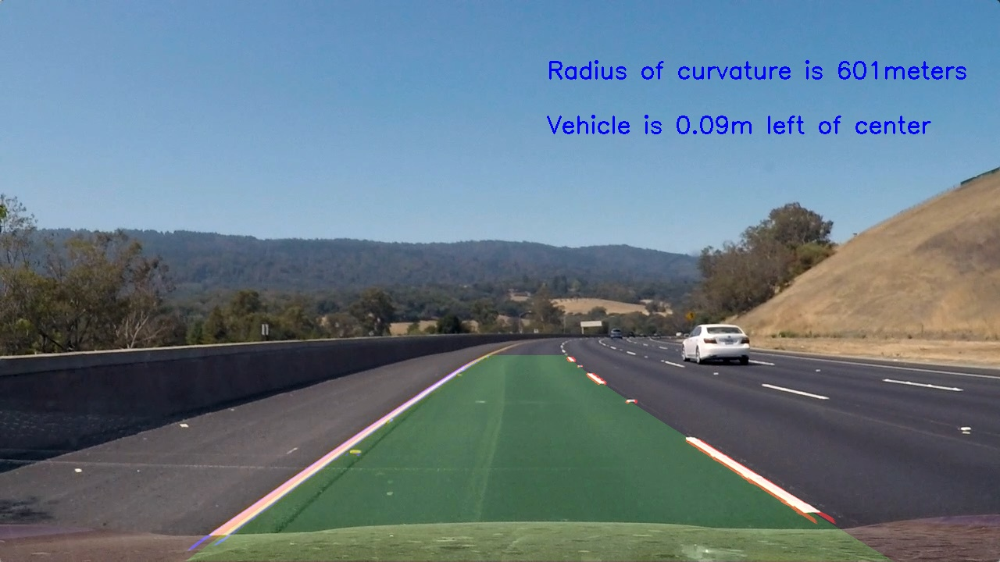

The goals / steps of this project are the following:

* Compute the camera calibration matrix and distortion coefficients given a set of chessboard images.
* Apply a distortion correction to raw images.
* Use color transforms, gradients, etc., to create a thresholded binary image.
* Apply a perspective transform to rectify binary image ("birds-eye view").
* Detect lane pixels and fit to find the lane boundary.
* Determine the curvature of the lane and vehicle position with respect to center.
* Warp the detected lane boundaries back onto the original image.
* Output visual display of the lane boundaries and numerical estimation of lane curvature and vehicle position.

The python source code is present in the file named "Advanced_LaneFindingPipeline.ipynb". The files contains the aforementioned steps and explains various building blocks,analysis,experiements done to achive project goals. The test images present in "test_images" were used to analyse and check intermediate results to fine tune the results. All the intermediate results, the final outputs for all test images and project output video are present in the "output_images" folder.

## Camera Calibration
The camera was calibrated using 9x6 chessboard images. Using objectpoints and image points , matrix and distortion coefficient were calculated. The code for this section can be found in file "Advanced_LaneFindingPipeline.ipynb" in 1st section "Camera Calibration using 9x6 chessboard images - Finding Object points and Image points" from line# 1 through #40 arrives at objectpoint (3-D points) and imagepoints(2-D points) using chessboard image corners. All the calibration images were used to create a list of imagepoints which are furher used to calibrate camera and un-distort image. 

The other section "Camera Calibration using 9x6 chessboard images - Camera Calibration and undistort test chessboard image" from line# 1 through #25 has code using which matrix and distortion coeffient is calculated. Using these coefficinets,a sample chessboard image is undistorted. 

  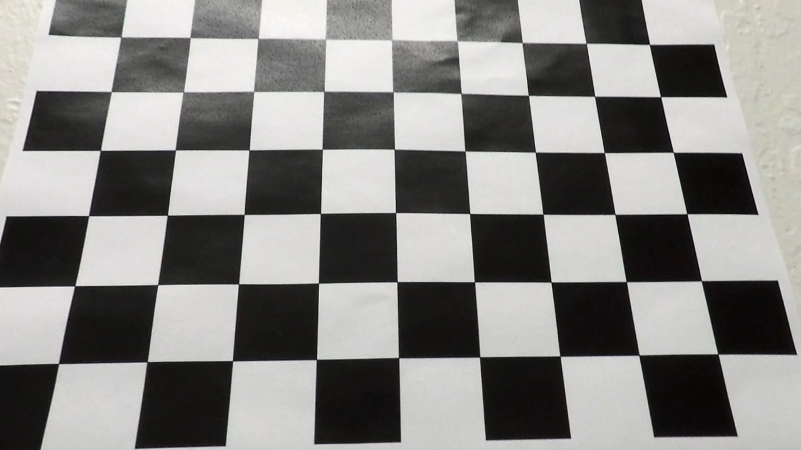

## Pipeline (Test Images)

### Example of a distortion-corrected image

The section in code file "Camera Calibration using 9x6 chessboard images - Camera Calibration and undistort test real world image" and from code line#1 to 19 corrects the distorted image using imagepoints and objectpoints.

  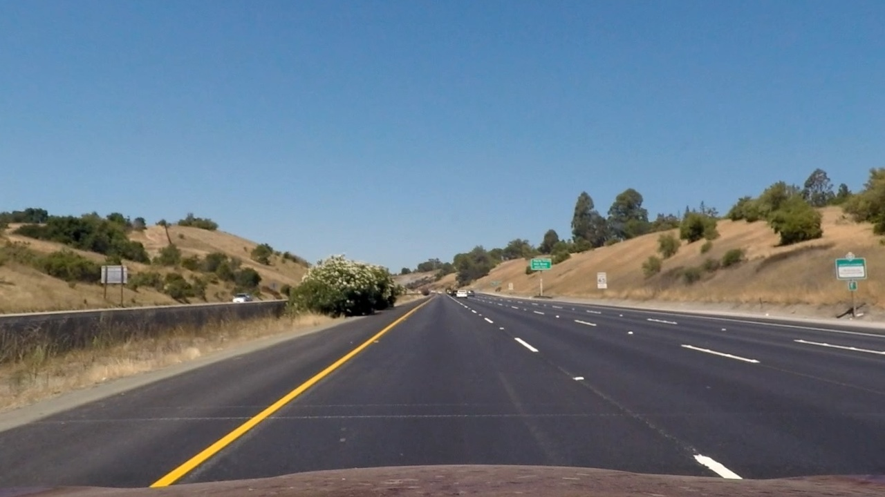

### Applying color transforms, gradients to the undistorted image

The section in code file "Merge/Integration of all functions to run over video frames and create annotated video" and from line 54 to 86 in the below function applies gradient and color thresholds to get an image in which lane line are seen.

`gradientColorThImage(ori,img, s_thresh=(170, 255), sx_thresh=(20, 100)):`


  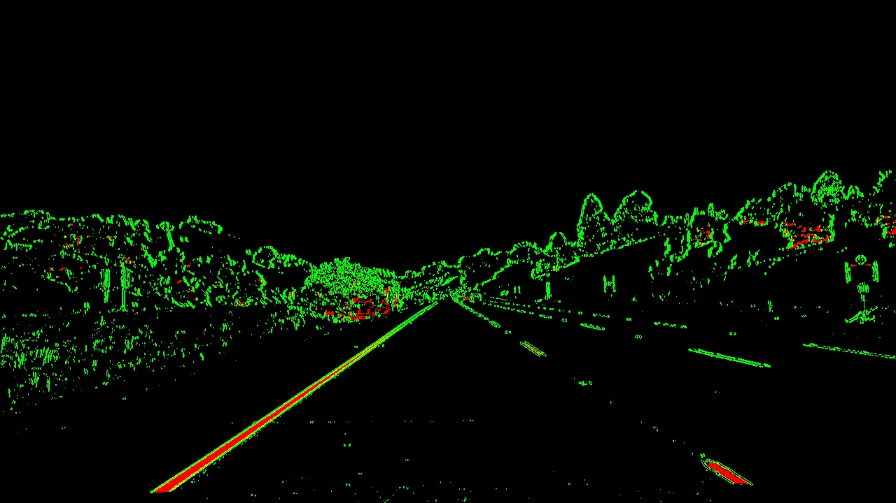

Sobel X gradient with optimal threshold values (with multiple trial and errors) were used to identify lane line and HLS color space was used to filter (yellow areas). The S channel with optimal threshold values (with multiple trial and errors) were used to further enhance lane dectations for yellow,shadow,bright surfaces.

### Perspective Transform
Measurements were done to arrive at optimal coordinate values for tranforming from driver view to bird eye view of the road image. The region of interest was shortened to lanes for this tranformation. Multiple measurements were done to check if bird eye view of road images for straight and curved (left/right) is tranformed correctly from original image.
The below are sample images and measurements done for this section : 

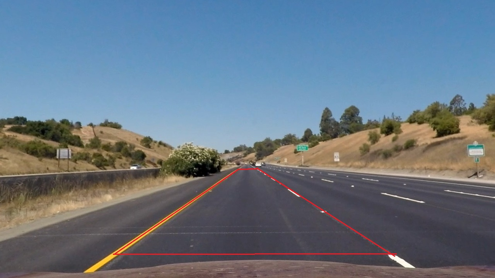  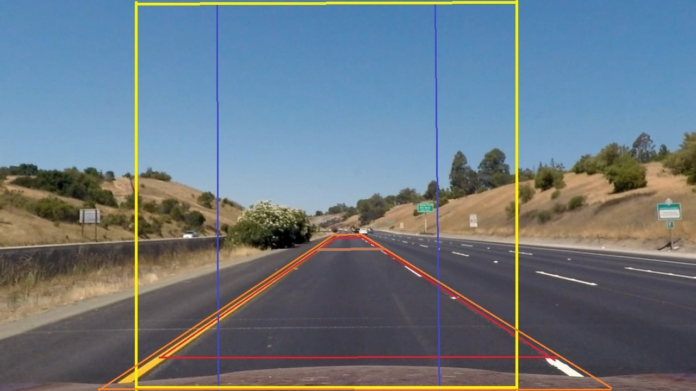  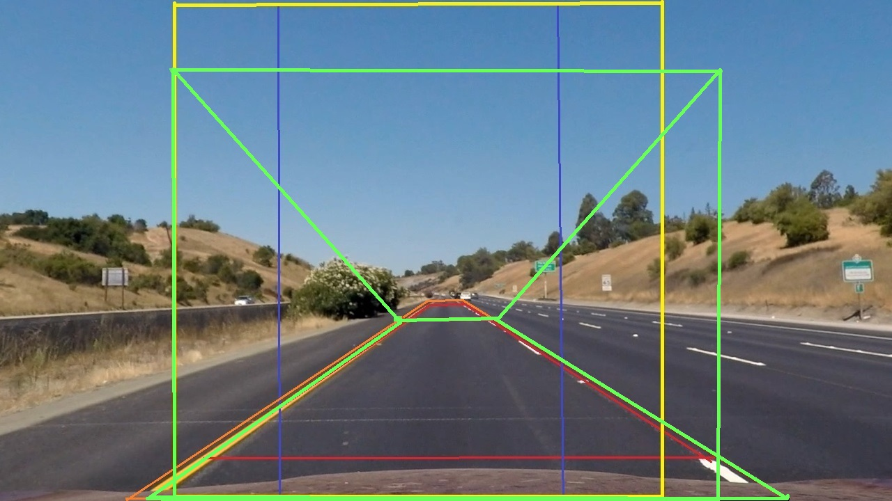  

The coordinate values were used to perform perepctive transform on the test images. Both the values "M" and "Minv" were dervied using standard tranformation functions for further steps

```
# Given src and dst points, calculate the perspective transform matrix
M = cv2.getPerspectiveTransform(src, dst)

# Given src and dst points, calculate the perspective transform matrix
Minv = cv2.getPerspectiveTransform(dst,src)

# Warp the image using OpenCV warpPerspective()
warped = cv2.warpPerspective(undist, M, img_size)
```
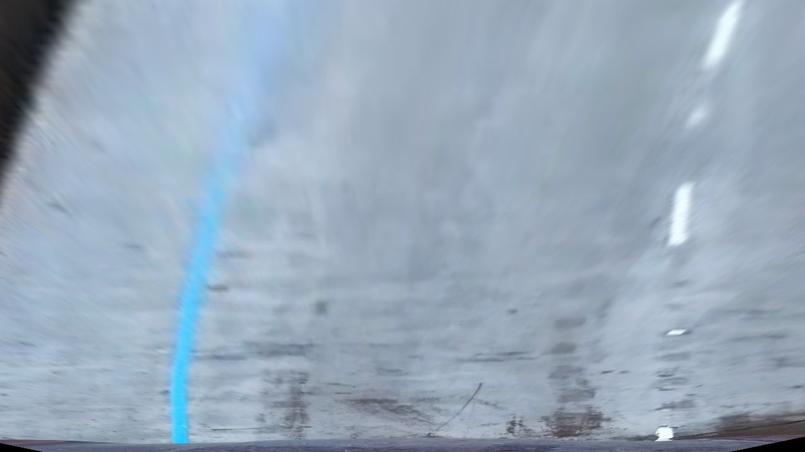  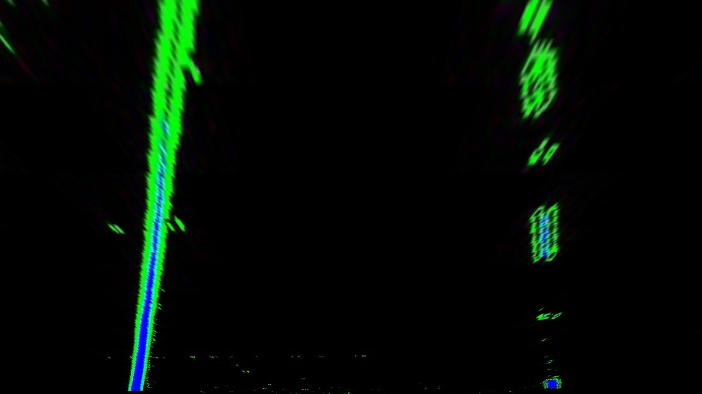

### Find Lane Pixels : Sliding Window

This step involved tranforming the binary image (bird eye view) and then checking the cumulative "y" values of the lower half of the image with the help of histogram function. This step is useful to understand and visualise the density of pixels (in turn lane lines)

In the code file of section "Find Lane Pixels : Sliding Window", the below functions are used to find the X values for left and right lanes having fixed incremental y values using sliding window. The steps followed for sliding window were : (a) Divide the image into two halfs (in x direction) (b) Find the starting point of x values in both halfs of the image (c) Window hyperparameters are defined (width and height) (e) Checking and storing values for each window (for left and right lanes) based on occurance of non-zero values (f) X and Y Values are then further used in polyfit to find the left_fit and right_fit coefficient parameters to plot curve.

```
find_lane_pixels(binary_warped)

fit_polynomial(binary_warped)
```

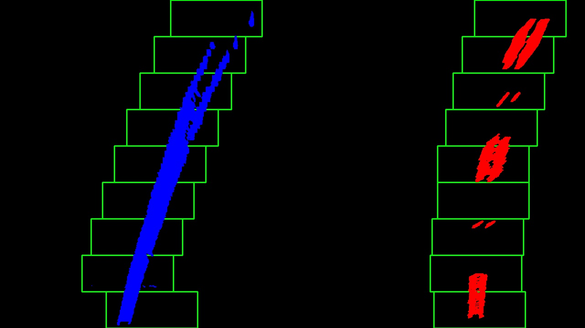

### Radius of curvature and vehicle center

The radius of curvature is calculated by using left_curved and right_curved by taking y value close to vehicle.The below formaulas and conversions from pixels to meters were used to arrive at the radius of curvature value. 

```
##Calculate radius of left and right radius of curvature
y_eval = np.max(ploty)
ym_per_pix = 30/img_shape[0] # meters per pixel in y dimension
xm_per_pix = 3.7/700 # meters per pixel in x dimension

# Calculation of R_curve (radius of curvature)
left_curverad = ((1 + (2*left_fit_cr[0]*y_eval*ym_per_pix + left_fit_cr[1])**2)**1.5) / np.absolute(2*left_fit_cr[0])
right_curverad = ((1 + (2*right_fit_cr[0]*y_eval*ym_per_pix + right_fit_cr[1])**2)**1.5) / np.absolute(2*right_fit_cr[0])
curvature = int((left_curverad + right_curverad)//2)
```

The center of vehicle is calculated  as below. Left and right X values are calculated closest to the vehicle to arrive at the center of drawn lane area. This value is subtracted from the one hald of image width and converted to meters. Based on the polarity of value (negative or postive) , it's determined if the vehicle is at the left or right part of identified lane.

`vehCenter = ((img_shape[1]/2) - ((rightx_center+leftx_center)/2) ) * xm_per_pix`

### Output Images with highlighted lane area, curvature of radius and vehicle center

In the code file the section "Reading and Writing to Video - Sample" calls the image process pipleline to process image frame wise.

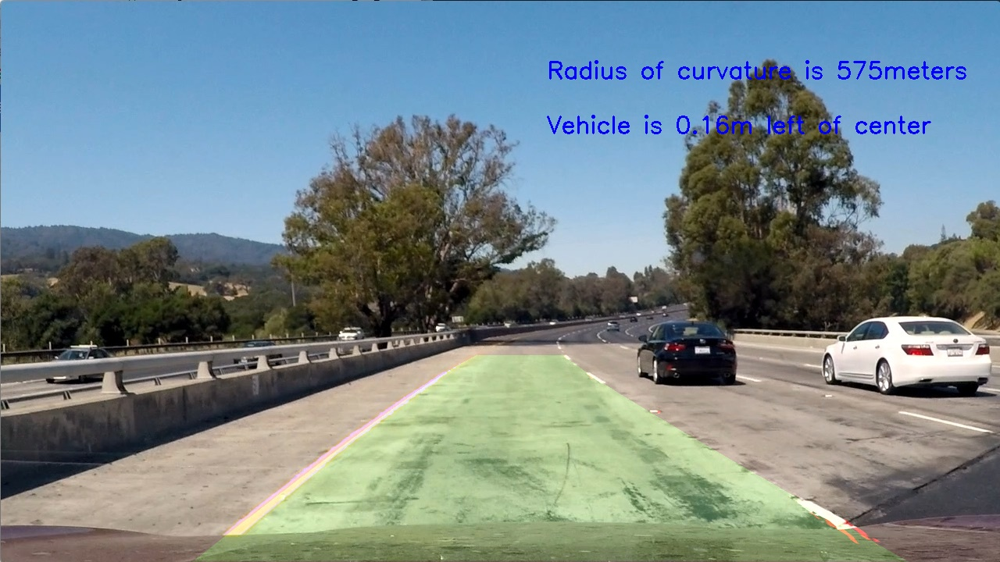  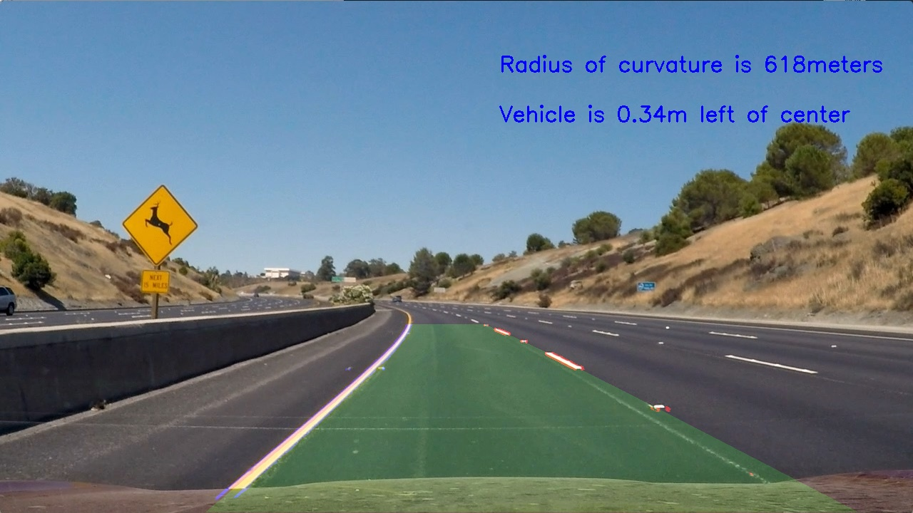    

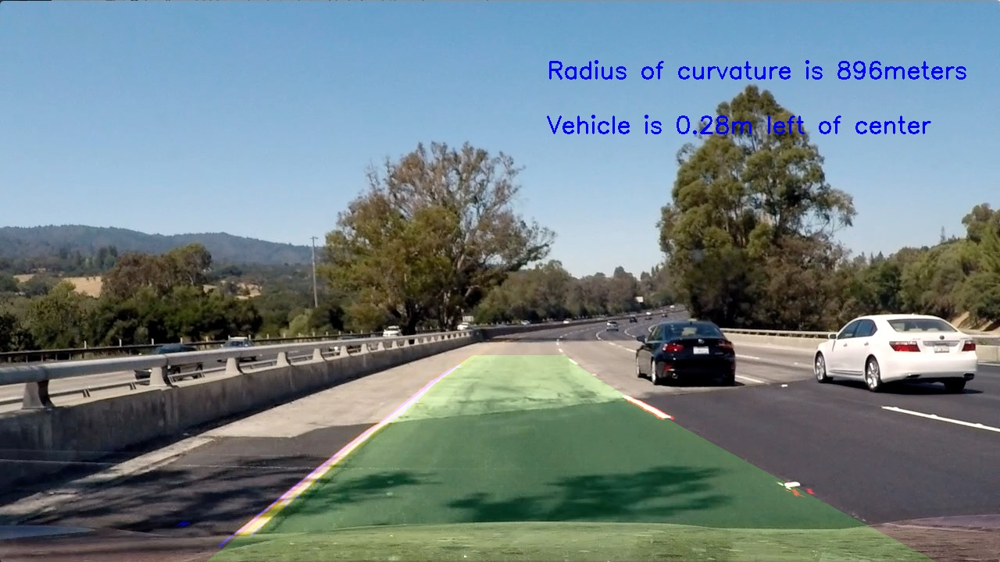  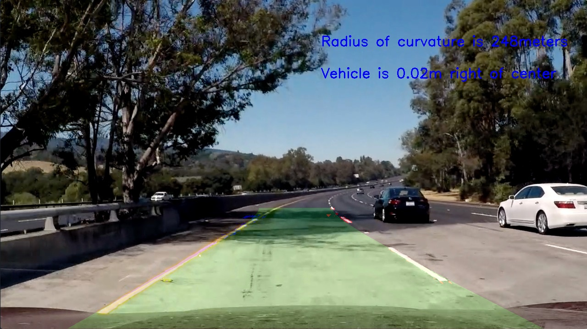  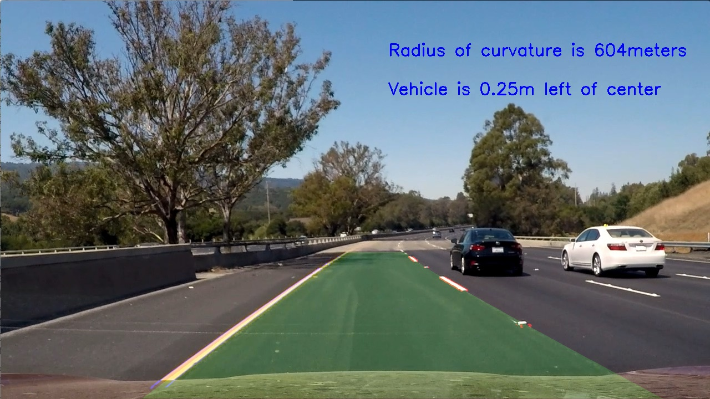  

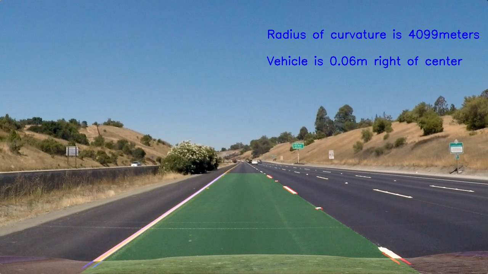  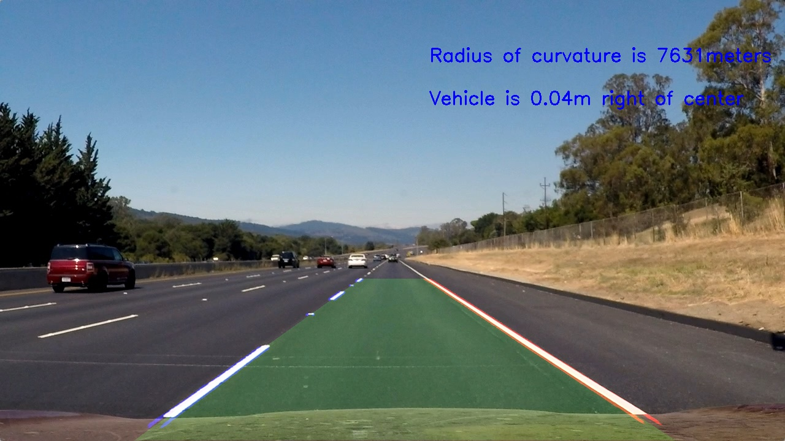

### Project output video

The about pipelines were applied on project video to get the annotated output video.
The project output video can be found [here](output_images/project_video_output.mp4)

## Discussions

I consider gradient,color thresholding and perpective tranform as the most important steps in this pipeline as the later steps uses the tranformed image and detected lane pixels for lanes identification and ploygon plotting. In my opinion, advanced concepts like machine learning and deep learning can be used to train and find parameters for a good amount of data which will make the entire process fast. Also, python has speed limitations unlike C/C++ programming languge for real word application and deployment on the micro-controllers.


